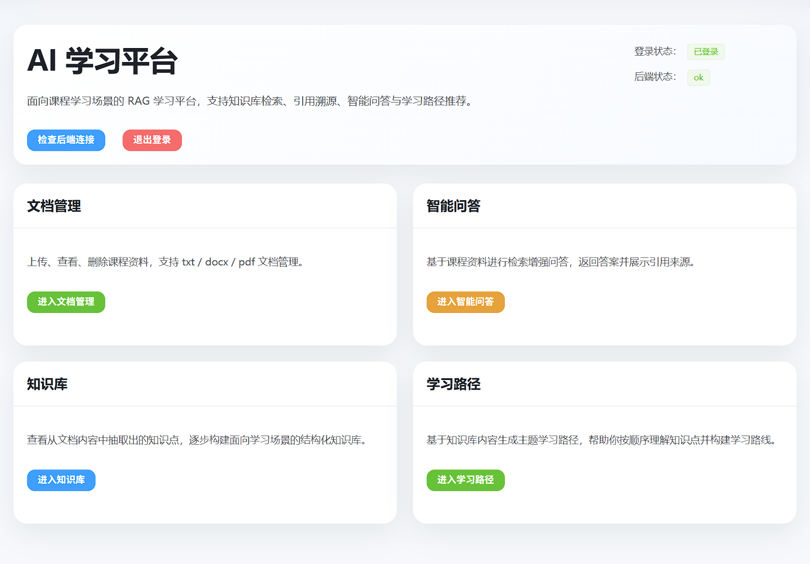
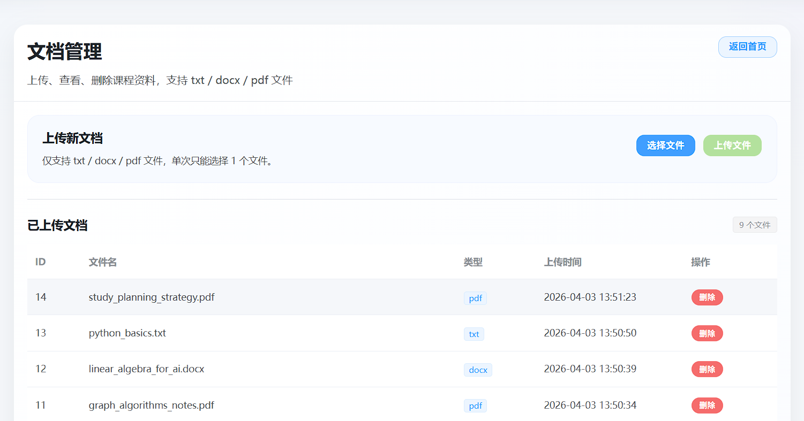
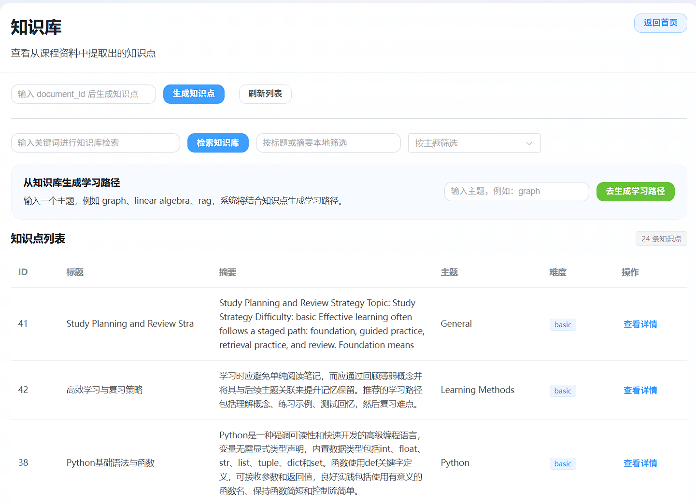
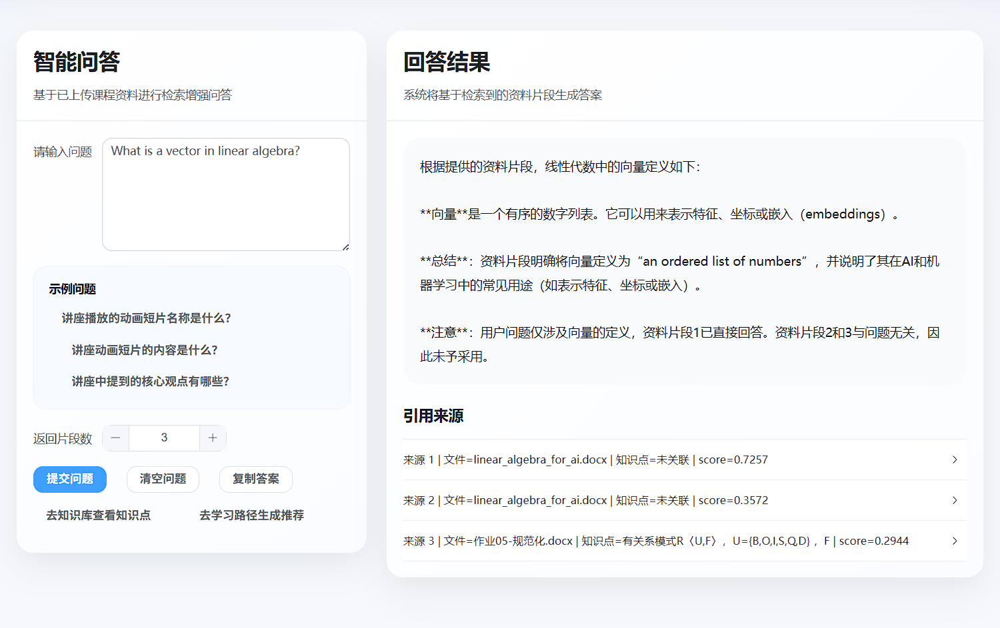
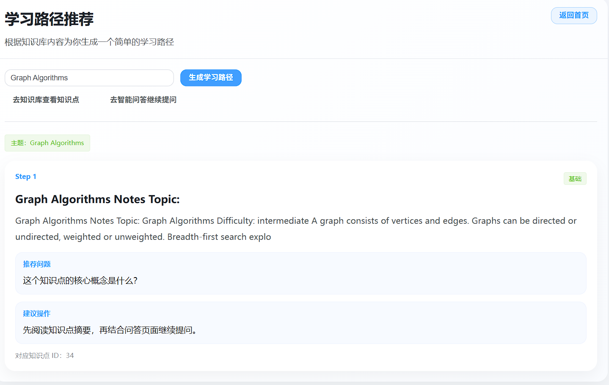

# RAG Learning Platform Plus
（未来可将论文分析系统与此项目联合起来，agent调用数据库，多模态转设置图片模板，rag检索论文文本）
<p align="center">
  <strong>A RAG-based learning platform for course document management, knowledge-base retrieval, citation tracing, source-grounded QA, and learning path recommendation.</strong>
</p>

<p align="center">
  Built with Vue 3, FastAPI, MySQL, FAISS, and LLMs.
</p>

<p align="center">
  
  
  
  
  
  
</p>

---

## Overview

RAG Learning Platform Plus is an upgraded learning-oriented RAG system designed for course materials and knowledge-driven study scenarios.

Compared with a basic document QA system, this version extends the platform into a more structured **learning platform** by adding:

- knowledge-base generation from uploaded documents
- knowledge-base retrieval
- citation tracing with knowledge-level sources
- source-grounded question answering
- learning path recommendation based on extracted knowledge items

This project is suitable for:

- LLM engineering portfolio projects
- RAG system practice
- AI application development showcases
- coursework / thesis demo systems
- internship and interview project presentation

---

## Key Features

### 1. User System
- User registration and login
- Token-based authentication
- Route guards for protected pages

### 2. Document Management
- Upload txt / docx / pdf files
- View uploaded documents
- Delete documents
- Remove related chunks and rebuild indexes after deletion

### 3. Document Processing
- Parse document content automatically
- Split text into chunks
- Store chunks in MySQL
- Build chunk-level retrieval pipeline

### 4. Knowledge Base
- Generate structured knowledge items from chunks
- View knowledge item list
- Search knowledge items by keyword
- Filter knowledge items by topic
- View knowledge item details

### 5. Citation Tracing
- Link QA results back to:
  - original file
  - chunk source
  - knowledge item title
  - knowledge summary
- Improve explainability and trustworthiness of answers

### 6. Source-Grounded QA
- Retrieve top-k relevant chunks
- Construct prompts with retrieved evidence
- Generate answers with LLM
- Display answer + citation sources in frontend

### 7. Learning Path Recommendation
- Generate topic-oriented learning paths
- Organize knowledge points into ordered steps
- Provide learning phases, suggested actions, and recommended follow-up questions

---

## Project Preview

### Home
<p align="center">
  
</p>

### Core Pages
<p align="center">
  
  
  
</p>

<p align="center">
  <sub>Document Management / Knowledge Base / Source-Grounded QA</sub>
</p>

<details>
  <summary><b>View more screenshots</b></summary>

  <br />

  #### Login
  <p align="center">
    
  </p>

  #### Learning Path
  <p align="center">
    
  </p>

</details>

---

## Tech Stack

### Frontend
- Vue 3
- Vite
- Vue Router
- Pinia
- Element Plus
- Axios

### Backend
- FastAPI
- SQLAlchemy
- PyMySQL
- Python-dotenv
- Python-multipart

### Database
- MySQL 5.7

### Document Processing
- PyMuPDF
- python-docx

### Retrieval
- sentence-transformers
- FAISS

### LLM Integration
- DeepSeek / OpenAI-compatible API

---

## System Workflow

### Document-to-Knowledge Workflow

```text
Upload document
→ Save raw file
→ Parse content
→ Split into chunks
→ Store chunks in MySQL
→ Build embeddings
→ Build / rebuild FAISS index
→ Generate structured knowledge items
```

### QA Workflow

```text
User question
→ Retrieve top-k relevant chunks
→ Attach source evidence
→ Build prompt
→ Call LLM
→ Return answer + citation sources
```

### Learning Path Workflow

```text
User inputs topic
→ Match related knowledge items
→ Organize them into ordered learning steps
→ Generate phase-based learning path
→ Recommend questions and actions
```

---

## Project Structure

```text
rag-learning-platform-plus/
├── frontend/
│   └── frontend-app/
│       ├── src/
│       │   ├── api/
│       │   ├── components/
│       │   ├── router/
│       │   ├── views/
│       │   ├── App.vue
│       │   ├── main.js
│       │   └── style.css
│       ├── package.json
│       └── ...
├── backend/
│   ├── app/
│   │   ├── api/
│   │   ├── core/
│   │   ├── models/
│   │   ├── schemas/
│   │   ├── services/
│   │   └── main.py
│   ├── requirements.txt
│   ├── uploads/
│   ├── faiss_index/
│   └── .env
├── assets/
├── .gitignore
└── README.md
```

---

## Environment

- Node.js 20+
- Python 3.11
- MySQL 5.7
- npm
- pip / venv

>Before running the project, configure the backend .env file with your database and LLM API settings.

---

## Backend Setup

```bash
cd backend
python -m venv .venv
.venv\Scripts\activate
pip install -r requirements.txt
uvicorn app.main:app --reload
```

Backend URL:
```
http://127.0.0.1:8000
```
Swagger Docs:
```
http://127.0.0.1:8000/docs
```

---

## Frontend Setup

```bash
cd frontend/frontend-app
npm install
npm run dev
```

Frontend URL:
```
http://localhost:5173
```
Environment Variables

Example backend ```.env```:

```env
MYSQL_USER=root
MYSQL_PASSWORD=your_mysql_password
MYSQL_HOST=127.0.0.1
MYSQL_PORT=3306
MYSQL_DB=ai_study_platform

OPENAI_API_KEY=your_api_key
OPENAI_BASE_URL=your_openai_compatible_base_url
OPENAI_MODEL=your_model_name
```
---

## Current Progress

- [x] User registration / login
- [x] Token-based auth and route guards
- [x] Document upload / deletion
- [x] Document parsing and chunk storage
- [x] FAISS semantic retrieval
- [x] Source-grounded RAG QA
- [x] Citation tracing
- [x] Knowledge item generation
- [x] Knowledge base page and search
- [x] Learning path recommendation
- [x] Product-style frontend UI

---

## Future Improvements

- [ ] Knowledge item deduplication
- [ ] Better knowledge extraction prompts
- [ ] Hybrid retrieval
- [ ] Reranking
- [ ] QA history
- [ ] OCR support
- [ ] Multi-turn dialogue
- [ ] Deployment
- [ ] Docker-based startup
- [ ] Role-based access control

---

## Project Positioning

This project focuses on LLM engineering and RAG application development, demonstrating:

- full-stack system design
- document ingestion and knowledge extraction
- semantic retrieval and citation tracing
- source-grounded LLM question answering
- learning-oriented AI product design

---

## License

This project is intended for learning, coursework, and personal portfolio use.
